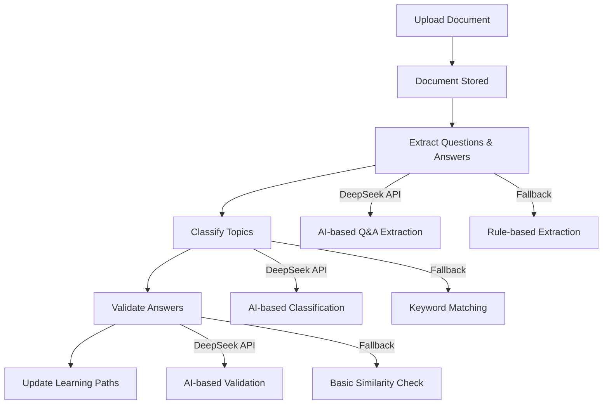
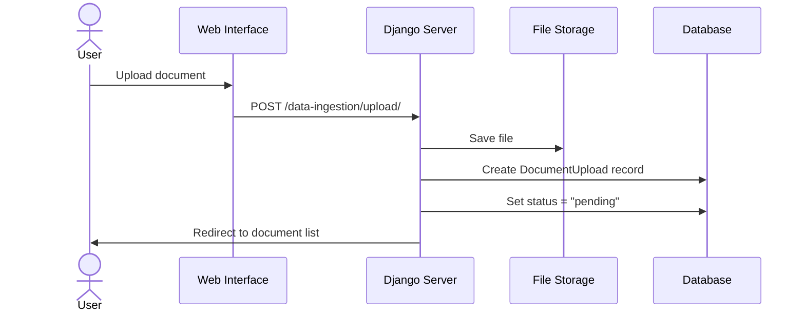
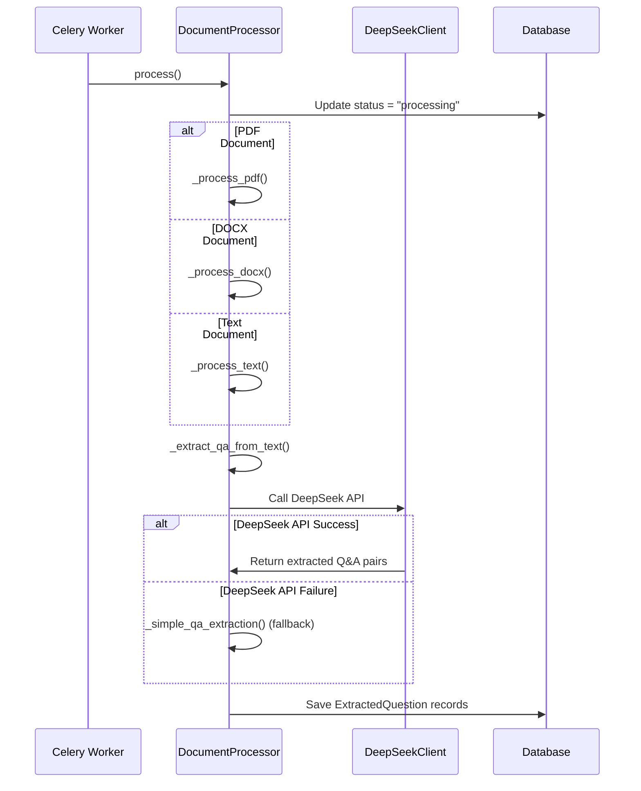
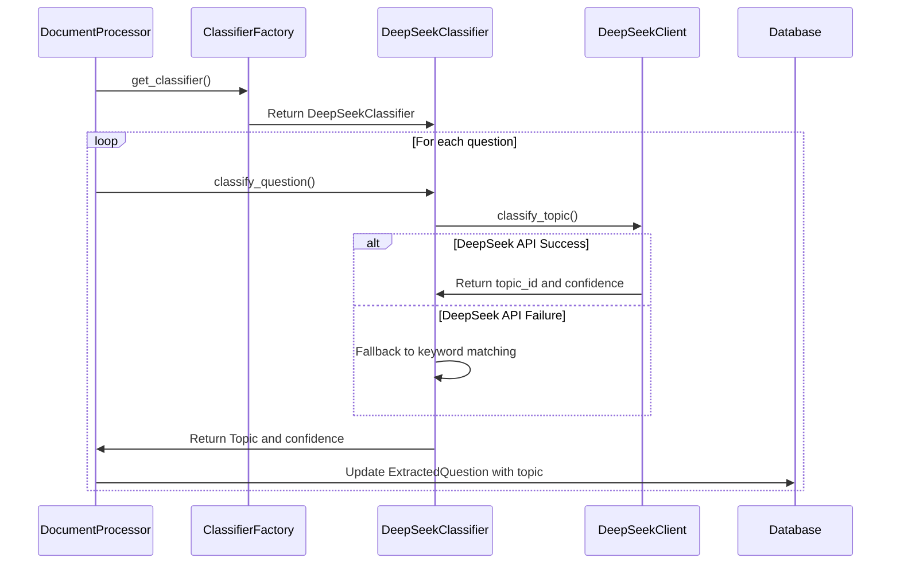
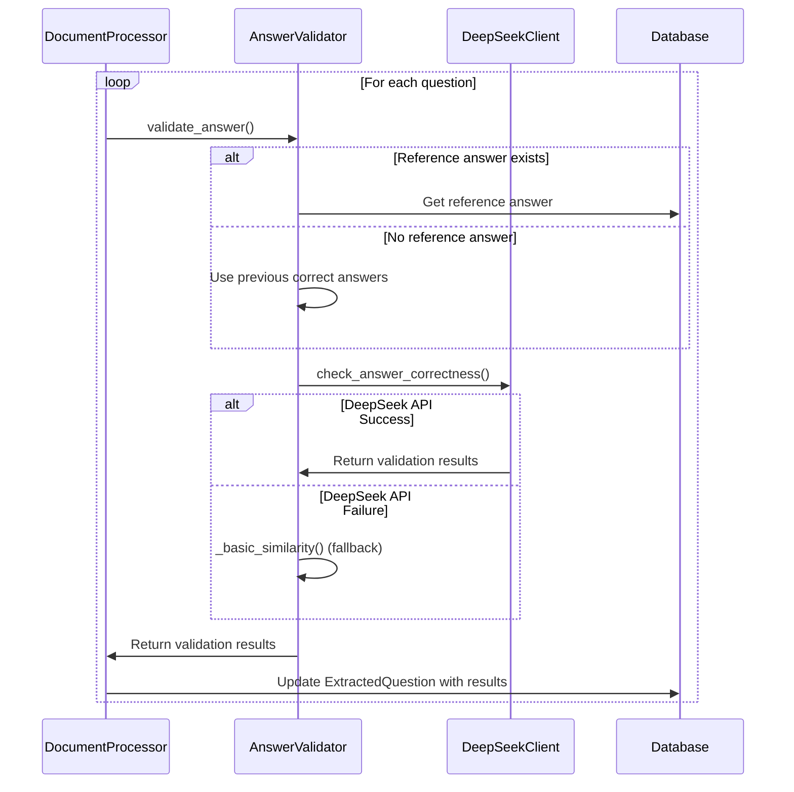
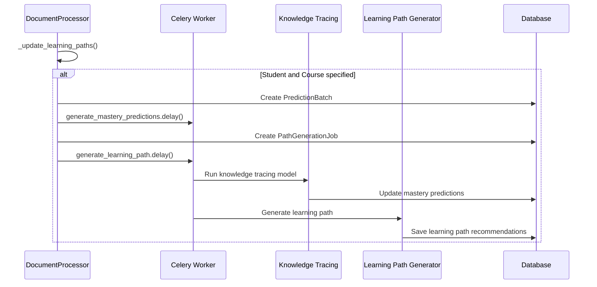

# Document Processing Workflow with DeepSeek Integration

This document provides a visual representation of the document upload and processing workflow, highlighting the DeepSeek integration points for topic classification and answer validation.

## Overall Process Flow



## Document Upload Process



## Question Extraction Process



## Topic Classification Process



## Answer Validation Process



## Learning Path Update Process



## DeepSeek API Integration Points

### 1. Question Extraction

```python
# In DocumentProcessor._extract_qa_from_text()
prompt = f"""
Extract all questions and their corresponding student answers from the following text.
Format each question-answer pair as:
QUESTION: [question text]
ANSWER: [student's answer]

Text to process:
{text}
"""

messages = [
    {"role": "system", "content": "You are an expert at identifying questions and answers in educational documents."},
    {"role": "user", "content": prompt}
]

# Call DeepSeek API
response = self.deepseek_client._call_api(messages)
content = response['choices'][0]['message']['content']

# Parse the response to extract Q&A pairs
```

### 2. Topic Classification

```python
# In DeepSeekClassifier.classify_question()
# Format topics for the prompt
topic_text = "\n".join([
    f"ID: {topic['id']}, Name: {topic['name']}, Description: {topic.get('description', '')}"
    for topic in available_topics
])

messages = [
    {"role": "system", "content": "You are an expert in Java programming and educational content classification."},
    {"role": "user", "content": f"""
Classify the following Java programming question into the most appropriate topic.

Available topics:
{topic_text}

Question to classify:
{question_text}

Respond with a JSON object with the following structure:
{{
    "topic_id": "The ID of the most relevant topic",
    "confidence": "A number between 0 and 1 indicating your confidence",
    "explanation": "Brief explanation of why this topic is the best match"
}}
"""
    }
]

# Call DeepSeek API
response = self.client._call_api(messages)
```

### 3. Answer Validation

```python
# In AnswerValidator.validate_answer()
messages = [
    {"role": "system", "content": "You are an expert in evaluating Java programming answers."},
    {"role": "user", "content": f"""
Evaluate whether the student's answer to the following Java programming question is correct.

Question:
{question_text}

Correct Answer:
{correct_answer}

Student's Answer:
{student_answer}

Respond with a JSON object with the following structure:
{{
    "is_correct": true/false, # Whether the answer is fundamentally correct
    "score": a number between 0 and 1 indicating the quality of the answer,
    "feedback": "Detailed feedback on the student's answer",
    "explanation": "Explanation of the score and assessment"
}}
"""
    }
]

# Call DeepSeek API
response = self.client._call_api(messages)
